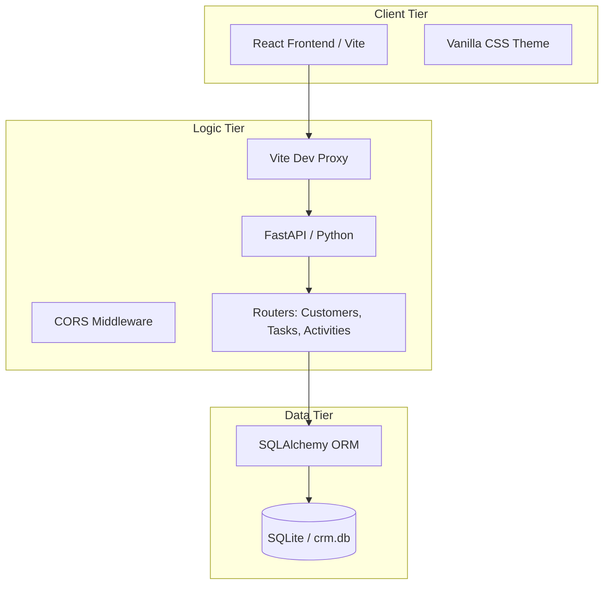
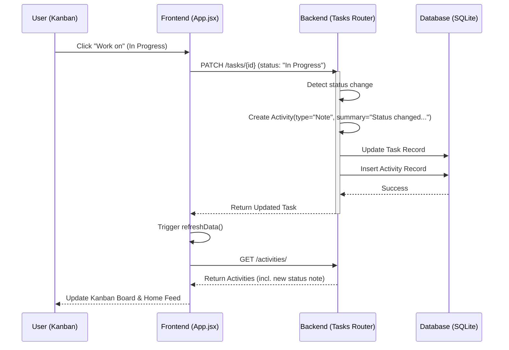

# Simple CRM System Architecture

## Overview
Simple CRM is a full-stack, data-driven application designed for relationship management. It uses a modern decoupled architecture where a React frontend communicates with a FastAPI backend via a proxied API layer.

## System Block Diagram

## Data Flow: Update Task Status (Sequence Diagram)
This diagram illustrates the automated audit trail feature where changing a task's status creates an interaction activity.

## Component Map
-   **Frontend (React 19):** Managed in `frontend/`. Uses a state-driven approach to refresh all dashboard components independently for high resilience.
-   **API (FastAPI):** Managed in `app/`. Provides a RESTful interface for all CRM entities.
-   **Persistence (SQLAlchemy):** Implements a relational schema with Many-to-Many support for tagging.
-   **Audit System:** A backend-driven trigger that ensures every task transition is permanently recorded in the interaction history.

## Multi-Agent Coordination
The architecture is designed to be modified by multiple agents in parallel.
-   **Atomic Routers:** Tasks, Activities, and Customers are decoupled into separate files to prevent merge conflicts.
-   **Shared Types:** Frontend components share a common API utility layer to ensure data consistency.
-   **Environment Parity:** The `DEPLOY.md` ensures that any environment (local, Martin's PC, or CI) runs the exact same architectural handshake.
