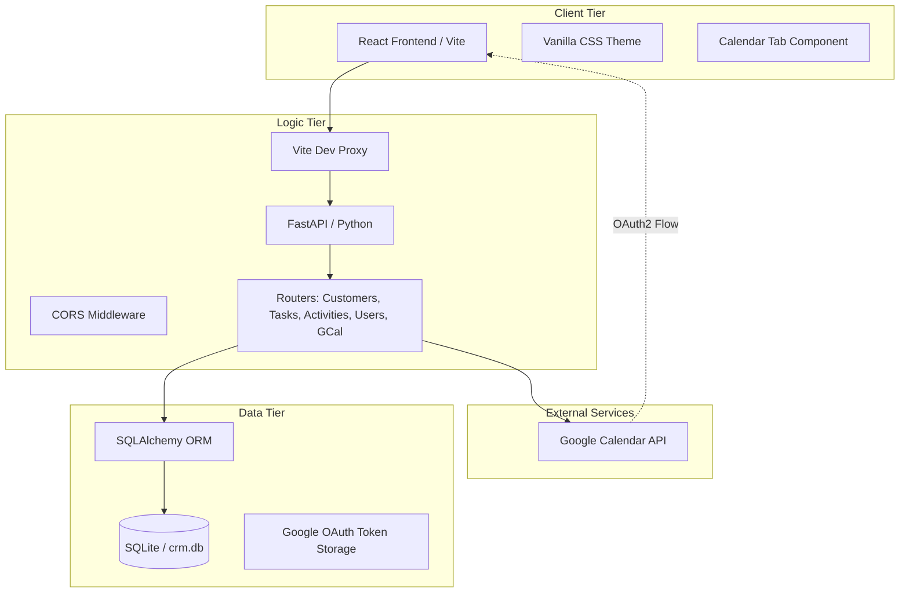
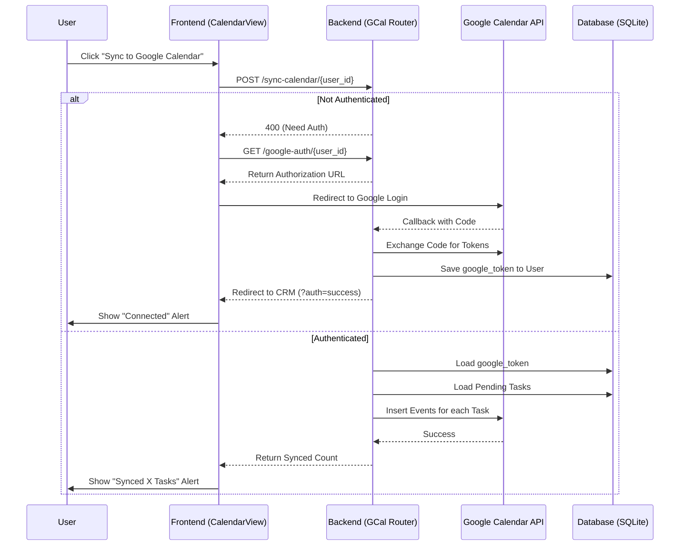

# Simple CRM System Architecture

## Overview
Simple CRM is a full-stack, data-driven application designed for relationship management. It uses a modern decoupled architecture where a React frontend communicates with a FastAPI backend via a proxied API layer.

## System Block Diagram

## Data Flow: Google Calendar Sync (Sequence Diagram)
This diagram illustrates the Phase 2 feature for OAuth2-based task synchronization.

## Component Map
-   **Frontend (React 19):** Managed in `frontend/`. Includes the `CalendarView` for monthly task visualization.
-   **API (FastAPI):** Managed in `app/`. The `google_calendar.py` router handles OAuth2 flows and synchronization logic.
-   **Persistence (SQLAlchemy):** Extended in Phase 2 to store encrypted OAuth tokens in the `User` model.
-   **External Integration:** Uses `google-api-python-client` for secure communication with Google Services.

## Multi-Agent Coordination
The architecture is designed to be modified by multiple agents in parallel.
-   **Atomic Routers:** Tasks, Activities, and GCal are decoupled into separate files to prevent merge conflicts.
-   **Shared Types:** Phase 2 introduced the `UserInternal` and `UserUpdate` schemas for secure token handling.
-   **Environment Parity:** The `DEPLOY.md` ensures that any environment runs the exact same architectural handshake.
